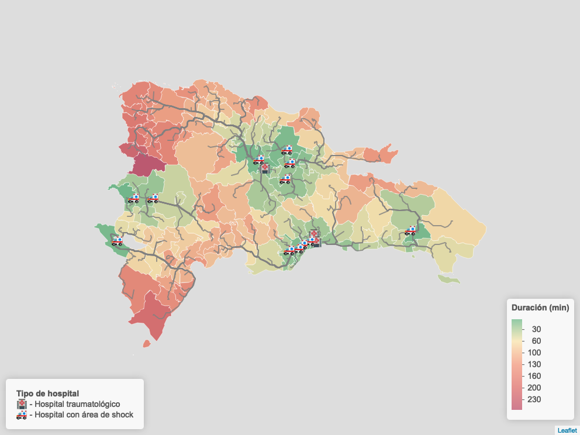
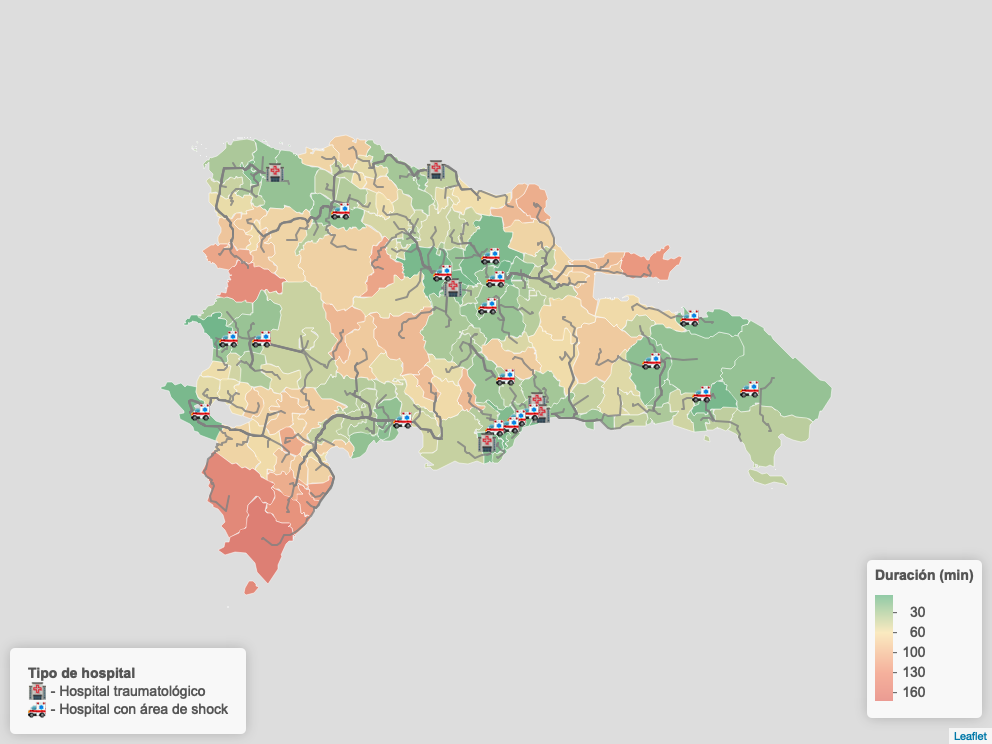

## Tiempo de transporte terrestre del sistema nacional de trauna de República Dominicana

Este proyecto explora el tiempo y la distancia de transporte desde los municipios oficiales de República Dominicana hacia las facilidades de saludo con capacidad de atención de traumas, con el fin de identificar posibles ineficiencias en la distribución geoespacial de los servicios especializados en trauma y cuantificar el impacto potencial de la incorporación de nuevas unidades de atención.

Se integran datos geoespaciales y servicios de navegación modernos para evaluar cambios significativos en los patrones de accesibilidad.

### Ambiente de desarrollo y dependencias

1- Clonar el repositorio para acceder al código fuente.

```bash
git clone https://github.com/Johan-rosa/transporte_hospitales.git
```

2- Hay quetener una versión resiente de R y Rstudio, y restaurar las dependencias del sistema.

```r
renv::restore()
```

3- Se debe contar con un API key ge google cloud platform para poder utilizar API de google maps distance matrix. Agregar el Key como una variable de ambiente en tu `.Renviron`

```
API_KEY=YourApIKeYHerE
```

### Recursos principales

#### Fuentes de datos

**Municipios de República Dominicana:** se utilizó la cartografía oficial del año 2012, proporcionada por la Oficina Nacional de Estadística (ONE), que incluye los límites administrativos y centroides de los 155 municipios del país.

**Hospitales traumátológicos y unidades de trauma existentes:** se recopiló información sobre hospitales traumatológicos y aquellos con unidades de trauma a partir del registro oficial del Ministerio de Salud Pública.

**Hospitales proyectados:** La ubicación de seis hospitales adicionales se definió con base en anuncios oficiales del Gobierno dominicano y planes de expansión del Ministerio de Salud Pública.

#### Scripts

1- `fetch_google_data.R`: contiene la lógica para consultar el tiempo de transporte de un punto a de orige hacia un destino. Guarda la información en formato crudo.

2- `save_output_data.R`: lógica para leer la data directa de google y exportar los outputs y resumenes para el análsisi estadístico y exploratorio.

3- `maps.R`: códigos para graficar los mapas 


#### Ejemplos

_**Tiempo de traslado hacia hospitales existentes**_




_**Tiempo de traslado hacia hospitales, incluyendo los planificados**_


